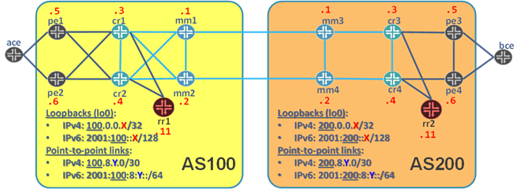

# Inter-AS Options A/B/C

</img>

This is a demo of the various options for building Inter-AS VPNs.
Can be used for various customer demos, as well as for personal development.
As per [RFC4364](https://tools.ietf.org/html/rfc4364) - Chapter 10:

* [Baseline](baseline/) - Baseline configuration to load
* [Baseline with services](baseline_with_services/) - Baseline configuration with L2/L3 VPNs (see below)
* [Option A](option-a/) - VRF-to-VRF stiching over IFLs (VLANs) - no MPLS
* [Option B](option-a/) - Exchange of VPNv[46] NLRI using MP-EBGP over NNI
* [Option C](option-a/) - Seamless MPLS using EBGP-LU + VPNv[46] NLRI exchange between RRs

See detailed [Topology Details here](Topology.pdf).

## Services

We generated sample services for this demo:

* 3x L3VPN (VPN-110, VPN-120 and VPN-130)
* 1x LDP-L2CKT (between pe2 and pe4)
* 1x BGP-VPLS (between pe1, pe2, pe3 and pe4)

